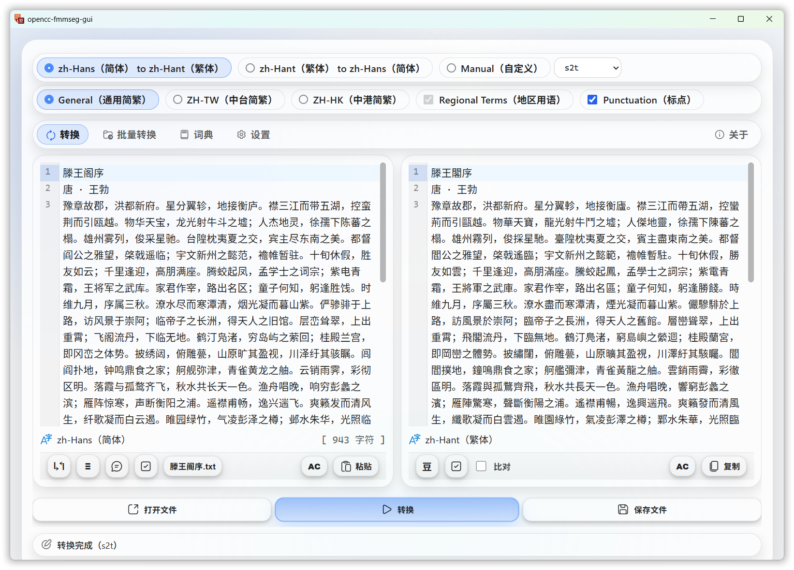
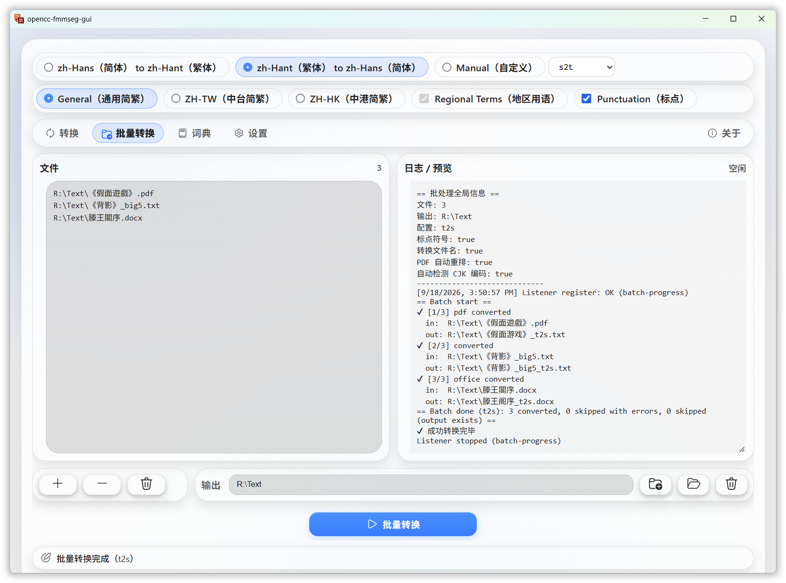
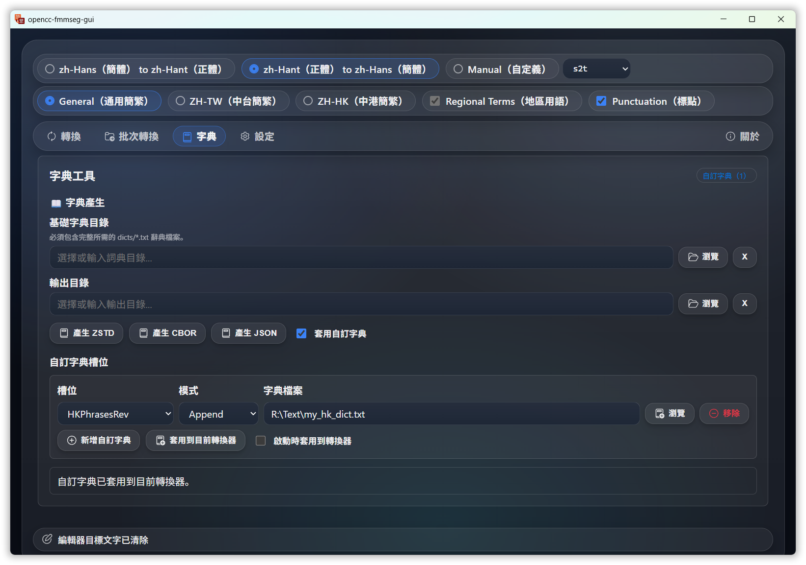

# opencc-fmmseg-gui

[](https://github.com/laisuk/opencc-fmmseg-gui/releases/latest)
[](https://github.com/laisuk/opencc-fmmseg-gui/releases)
[](./LICENSE)

A **modern cross‑platform Chinese text converter** built with **Tauri + Vite** and powered by the Rust
**opencc-fmmseg** engine.

The application provides fast **Simplified ↔ Traditional Chinese conversion**, PDF text extraction,
and batch processing in a lightweight desktop GUI.

---

# ✨ Highlights

• ⚡ **Fast Rust conversion engine** (opencc-fmmseg)  
• 🖥 **Cross-platform desktop app** (Windows / Linux / macOS)  
• 📚 **Office / EPUB / PDF support**  
• 📄 **PDF text extraction with CJK reflow**  
• 🔍 **Compare mode to highlight conversion differences**  
• 📂 **Batch conversion**  
• 🎨 **Modern UI (Tauri + Vite)**

---

# 🚀 Download

Download the latest release:

https://github.com/laisuk/opencc-fmmseg-gui/releases/latest

Example release assets:

| Platform | Package                                                        |
|----------|----------------------------------------------------------------|
| Windows  | `opencc-fmmseg-gui-vX.Y.Z-windows-x64-portable.exe` (portable) |
| Windows  | `opencc-fmmseg-gui_X.Y.Z_x64-setup.exe` (installer)            |
| Windows  | `opencc-fmmseg-gui_X.Y.Z_x64_en-US.msi` (MSI installer)        |
| Linux    | `opencc-fmmseg-gui_X.Y.Z_amd64.AppImage` (portable)            |
| Linux    | `opencc-fmmseg-gui_X.Y.Z_amd64.deb`                            |
| Linux    | `opencc-fmmseg-gui-X.Y.Z-1.x86_64.rpm`                         |
| macOS    | `opencc-fmmseg-gui_X.Y.Z_x64.dmg`                              |
| macOS    | `opencc-fmmseg-gui-vX.Y.Z-macos.app.zip` (portable)            |

### Notes

* **Portable** builds run without installation.
* **Installers** integrate the application with the operating system.
* Linux users can run the portable version directly:

    ```
    chmod +x opencc-fmmseg-gui_*.AppImage
    ./opencc-fmmseg-gui_*.AppImage
    ```

The application is distributed as a **stand‑alone desktop app** and requires no additional runtime.

---

# 🧠 Conversion Engine

The GUI is powered by **opencc-fmmseg**, a Rust implementation inspired by OpenCC.

Features include:

- OpenCC‑compatible dictionaries
- Forward Maximum Matching (FMM) segmentation
- multi‑stage dictionary conversion
- optimized Rust performance

Repository:

https://github.com/laisuk/opencc-fmmseg

---

# 📄 Supported Formats

The application supports most **text-based document formats**.

| Category  | Formats                                           |
|-----------|---------------------------------------------------|
| Text      | `.txt`, `.md` (any text-based filetypes)          |
| Subtitles | `.srt`, `.vtt`, `.ass`                            |
| Office    | `.docx`, `.xlsx`, `.pptx`, `.odt`, `.ods`, `.odp` |
| eBook     | `.epub`                                           |
| PDF       | `.pdf` (text-embedded)                            |

---

# 📑 PDF Extraction

PDF files are processed using **PDFium** for accurate text extraction.

Advantages:

- reliable CJK character extraction
- correct handling of embedded fonts
- improved multi‑column handling
- better layout reconstruction

⚠ **Scanned PDFs are not supported** (OCR is outside the scope of this project).

---

# 🧩 CJK Paragraph Reflow

Extracted PDF text can optionally apply **CJK reflow** to improve readability.

The reflow system attempts to:

- merge broken lines
- reconstruct dialogue
- detect chapter titles
- remove page extraction artifacts

Example:

```
不抱任何期待点了国产红酒，却出乎意料地回味悠长。这难道是料理的魔
力？
```

becomes

```
不抱任何期待点了国产红酒，却出乎意料地回味悠长。这难道是料理的魔力？
```

The goal is **clean reading text**, not exact layout reconstruction.

---

# 🖥 User Interface

## Single Conversion



Workflow:

1. Paste text or open a file
2. Choose conversion configuration
3. Click **Convert**

## Compare Mode

After conversion, the **Compare** option can be enabled to highlight
differences between the source text and converted output.

Changed characters are visually marked so users can quickly review
conversion results.

---

## Batch Conversion



Workflow:

1. Add files to the list
2. Select conversion configuration
3. Choose output directory
4. Click **Batch Convert**

---

## Dark Theme



The interface supports **dark‑mode friendly UI**.

---

# 🏗 Architecture

```
opencc-fmmseg-gui
        │
        ▼
   opencc-fmmseg (Rust engine)
        │
        ▼
   OpenCC dictionaries
```

### Frontend

- Tauri
- Vite
- TypeScript
- HTML / CSS
- CodeMirror 6

### Backend

- Rust
- opencc-fmmseg
- PDFium

---

# 🛠 Development

Clone the repository:

```
git clone https://github.com/laisuk/opencc-fmmseg-gui.git
```

Enter the directory:

```
cd opencc-fmmseg-gui
```

Install frontend dependencies:

```
npm install
```

Run development mode:

```
npm run tauri dev
```

Build release version:

```
npm run tauri build
```

---

# 🤝 Contributing

Contributions are welcome.

If you'd like to improve the project:

1. Fork the repository
2. Create a feature branch
3. Submit a pull request

Bug reports and feature suggestions are also appreciated.

---

# 📜 License

MIT License

---

# 🙏 Acknowledgements

• **OpenCC** – Chinese conversion dictionaries  
https://github.com/BYVoid/OpenCC

• **opencc-fmmseg** – Rust implementation  
https://github.com/laisuk/opencc-fmmseg

• **PDFium** – PDF rendering and extraction engine

• **CodeMirror 6** – high-performance text editor used in the GUI  
https://codemirror.net/

• **Tauri** – cross-platform desktop framework  
https://tauri.app
